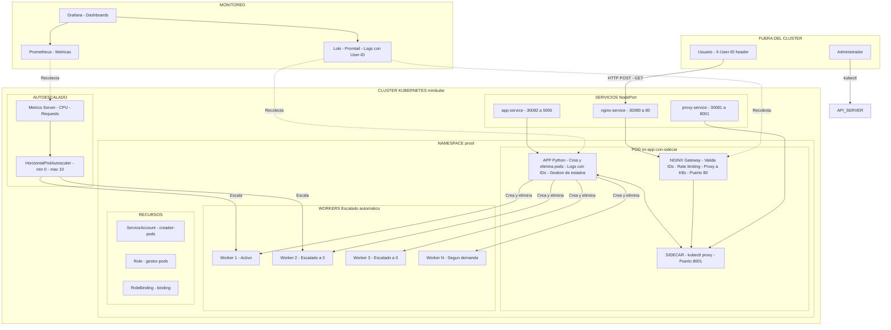
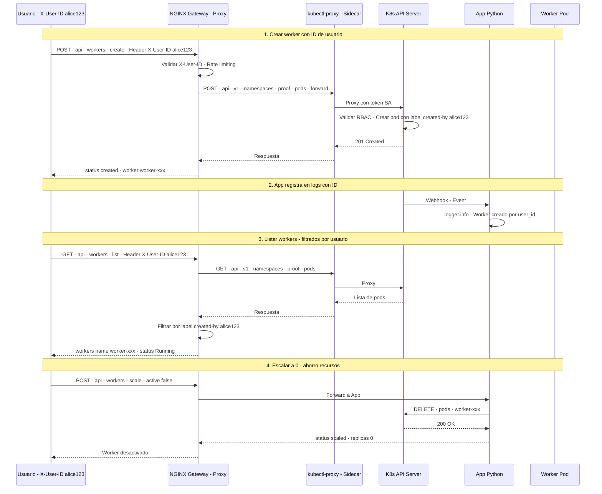
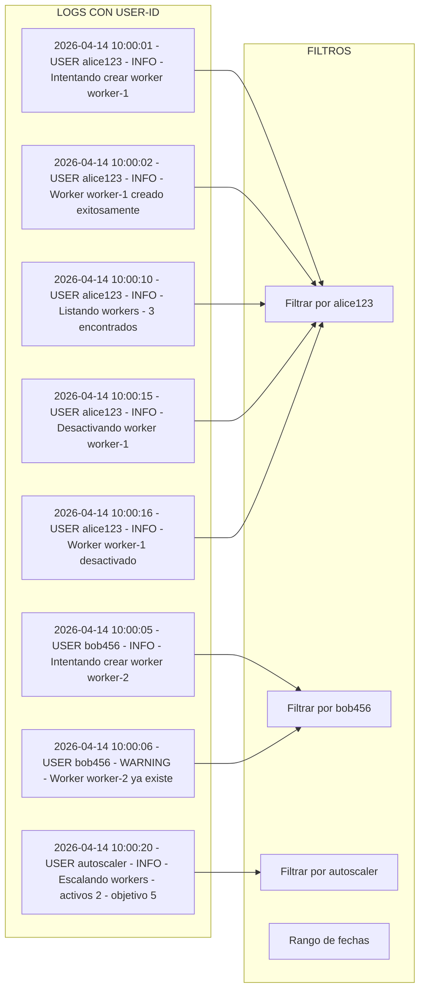
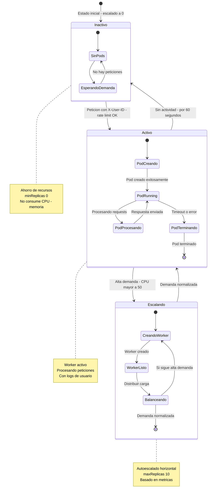
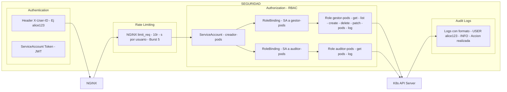

# 🚀 Sistema de Workers con Sidecar - Documentación Completa

## 📋 Tabla de Contenidos
1. [Arquitectura General](#arquitectura-general)
2. [Componentes](#componentes)
3. [Flujo de Peticiones](#flujo-de-peticiones-con-id-de-usuario)
4. [Logs y Monitoreo](#logs-y-monitoreo-con-ids-de-usuario)
5. [Estados de Activación](#estados-de-activación-ahorro-de-recursos)
6. [Seguridad y RBAC](#seguridad-y-rbac)
7. [Instalación](#instalación)
8. [Configuración](#configuración)
9. [Uso](#uso)
10. [API Referencia](#api-referencia)
11. [Escalado Automático](#escalado-automático)
12. [Solución de Problemas](#solución-de-problemas)
13. [Contribución](#contribución)

---

## 🏗️ Arquitectura General

#

#

#

#

